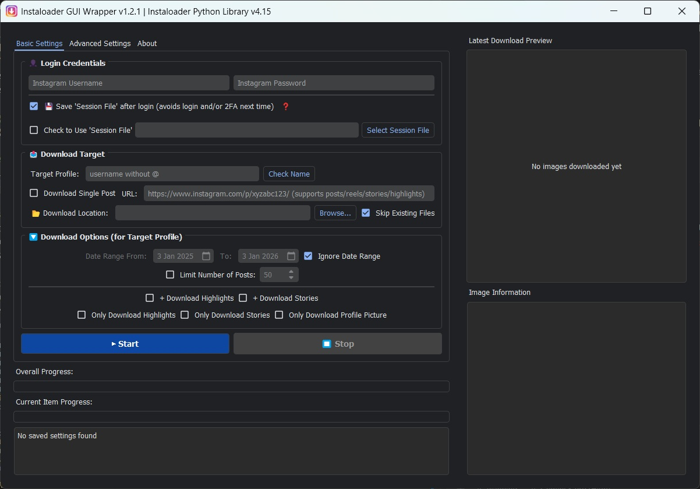

# Instaloader GUI Wrapper

<div align="center">
  
  <br />
  <br />

[](https://www.python.org/downloads/)
[](https://opensource.org/licenses/MIT)
[](https://pypi.org/project/PyQt6/)
</div>

A desktop application that provides a user-friendly graphical interface for downloading content from Instagram profiles using the [Instaloader](https://instaloader.github.io/) Python library.



## ✨ Features

- **Profile Downloads** - Posts, stories, highlights, and profile pictures
- **Saved Posts** - Download your own saved posts collection with flexible organization
- **Single Content** - Download individual posts, reels, stories, or highlights via URL
- **Anti-Detection** - Highly configurable "Balanced" timing system to mimic human behavior
- **2FA Support** - Full two-factor authentication support
- **Unified Progress** - Overall progress bar for all download modes
- **Enhanced Stop** - Immediate cancellation responsiveness during stays and retries
- **Date Filtering** - Download content within specific date ranges
- **Live Preview** - See downloaded content in real-time
- **Dark Theme** - Modern PyQt6 dark-themed interface

## 🚀 Quick Start

### Option 1: Run from Source

```bash
# Clone the repository
git clone https://github.com/marhensa/instaloader-gui-wrapper.git
cd instaloader-gui-wrapper

# Install dependencies
pip install -r requirements.txt

# Run the application
python run.py
```

### Option 2: Windows Executable

Download the latest release from [Releases](https://github.com/marhensa/instaloader-gui-wrapper/releases) and run `Instaloader-GUI-Wrapper.exe`.

## 📖 Usage

1. **Login** - Enter credentials or use a session file
2. **Select Target** - Enter a username or paste a post/reel/story URL
3. **Choose Location** - Select download directory
4. **Start Download** - Click ▶ Start

### Supported URL Formats

| Type | Example URL |
|------|-------------|
| Post | `instagram.com/p/ABC123` |
| Reel | `instagram.com/reel/ABC123` |
| Story | `instagram.com/stories/username/123456` |
| Highlight | `instagram.com/stories/highlights/123456` |

### Download Structure

**Standard Downloads (Target Profile and Single Post):**
```
downloads/
└── username/
    ├── profile_pic/
    ├── posts/
    ├── stories/
    └── highlights/
```

**Saved Posts Downloads(Default):**
```
downloads/
└── saved_posts/
    ├── username1/
    │   ├── 2024-01-01_UTC.jpg
    │   └── ...
    └── username2/
        └── ...
```

**Saved Posts Downloads (Single Folder):**
```
downloads/
└── saved_posts/
    ├── username1_2024-01-01_UTC.jpg
    ├── username2_2024-01-02_UTC.jpg
    └── ...
```

## ⚙️ Advanced Settings

| Setting | Description | Default |
|---------|-------------|---------|
| Base Delay | Baseline time between requests | 3s |
| Random Jitter | Extra random time to appear human | 2s |
| Story Multiplier | Safety multiplier for stories/highlights | 1.5x |
| Long Pause | Range for random "session" breaks | 10-17s |
| Critical Wait | Recovery time after rate limits | 30min |

## 🔒 Security

- Credentials are never stored in plain text
- Session files location:
  - Windows: `%localappdata%\Instaloader\session-username`
  - Linux/Mac: `~/.config/instaloader/session-username`
- **Delete session files on shared computers!**

## 🔧 Building from Source

### Windows
```bash
build.bat
# Output: dist/Instaloader-GUI-Wrapper.exe
```

### Linux

**Requirements**: `python3`, `pip`, `binutils`, `fuse-libs`, `file`

```bash
# Install dependencies (Fedora/RHEL)
sudo dnf install -y python3 binutils fuse-libs file

# Build
chmod +x build.sh
./build.sh
```

This will produce:
- `dist/Instaloader-GUI-Wrapper` (Executable)
- `Instaloader-GUI-Wrapper-x86_64.AppImage` (Portable AppImage)

### Manual Build
```bash
pip install pyinstaller
pyinstaller --onefile --windowed --name "Instaloader-GUI-Wrapper" run.py
```

## 📁 Project Structure

```
instaloader-gui-wrapper/
├── run.py              # Entry point
├── requirements.txt    # Dependencies
├── build.bat           # Build script
└── src/
    ├── gui/            # UI components
    ├── core/           # Download logic
    └── config/         # Settings
```

## ⚠️ Disclaimer

This tool is for **personal use only**. Respect Instagram's terms of service and copyright rules. Excessive downloads may trigger rate limiting. The developer is not responsible for misuse.

## ☕ Support

If you find this tool useful, consider supporting development:

[](https://ko-fi.com/marhensa)

## 📄 License

MIT License © 2026 [@marhensa](https://github.com/marhensa)
